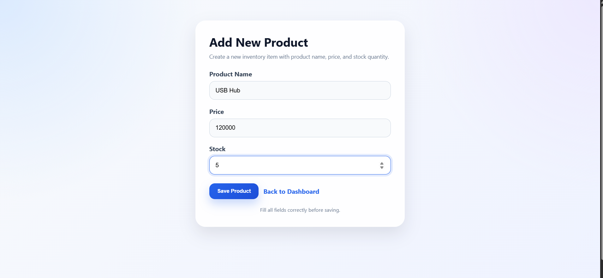
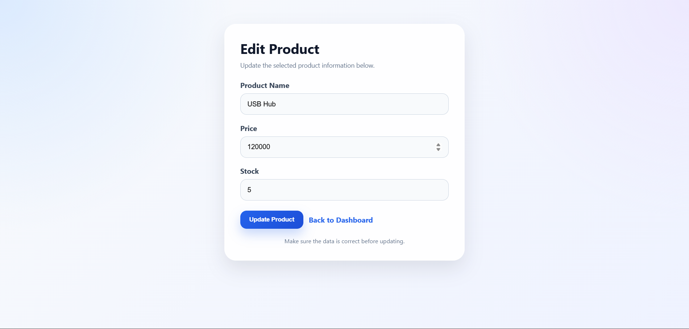

# Inventory Management System

A simple and elegant Inventory Management System built using **PHP and MySQL**.  
This project allows users to manage products, track stock, and monitor inventory value through a clean dashboard interface.

---

## ✨ Features

- Add new product
- Edit product information
- Delete product
- Search product
- Display product list
- Total products counter
- Total stock counter
- Total inventory value
- Modern and responsive dashboard UI

---

## 🛠 Technologies Used

- PHP
- MySQL
- HTML
- CSS
- XAMPP

---

## 📷 Preview

### Dashboard

### Add Product

### Edit Product

---

## 🗂 Project Structure
